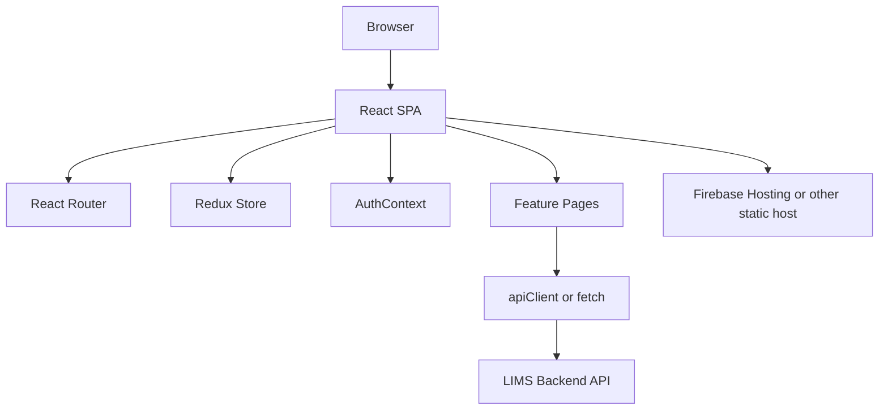
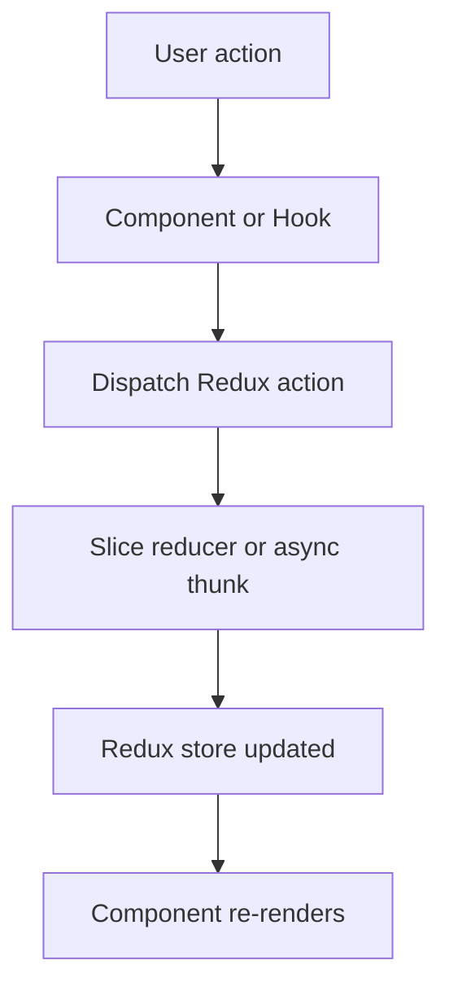
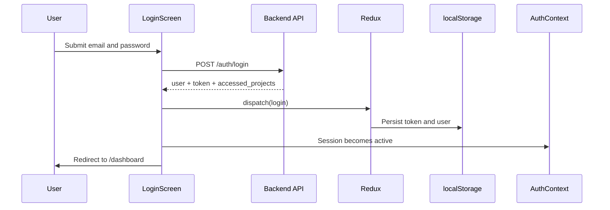
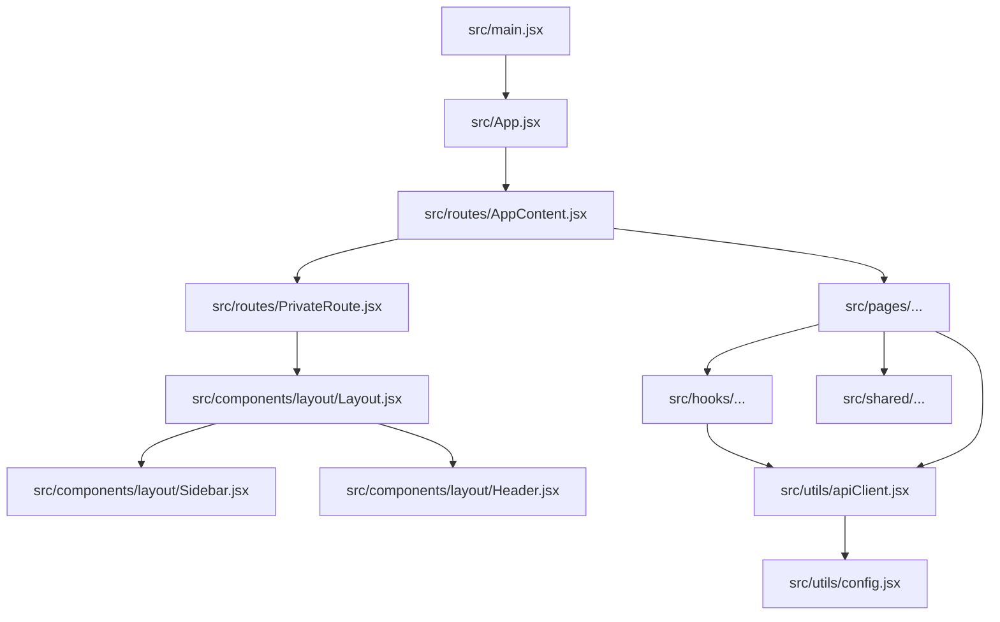

# Source Code Documentation

Last updated: 2026-06-01

## 1. Overview

`lims_fe` is a single-page React application for managing land acquisition and land-related records across private, government, and forest land workflows.

At a high level, the frontend:

- authenticates users against the backend
- stores session and user metadata in Redux + `localStorage`
- renders role-sensitive navigation
- loads feature modules by route
- sends API requests to the backend for CRUD, reports, dashboards, and uploads

## 2. High-Level Architecture



## 3. Application Bootstrap

### Entry point

- [src/main.jsx](/d:/ritishree/updated/lims_fe/src/main.jsx)

Responsibilities:

- mounts the React app
- wraps the app with Redux `Provider`

### Root app

- [src/App.jsx](/d:/ritishree/updated/lims_fe/src/App.jsx)

Responsibilities:

- initializes `BrowserRouter`
- renders `AppContent`

## 4. Routing Model

### Route container

- [src/routes/AppContent.jsx](/d:/ritishree/updated/lims_fe/src/routes/AppContent.jsx)

Responsibilities:

- declares public and protected routes
- lazy-loads feature modules
- redirects unauthenticated users away from private routes
- fetches shared lists after login

### Route protection

- [src/routes/PrivateRoute.jsx](/d:/ritishree/updated/lims_fe/src/routes/PrivateRoute.jsx)

Responsibilities:

- checks token presence from Redux or `localStorage`
- checks session state via `AuthContext`
- redirects unauthenticated users to `/`

Important note:

- role-based route restrictions are commented out, so authorization is primarily handled in the menu and page-level UI today.

### Routing diagram

```mermaid
flowchart LR
    A[/] --> B[LoginScreen]
    A2[/forgot-password] --> C[ForgotPassword]
    A3[/reset-password/:token] --> D[ResetPassword]

    E[PrivateRoute] --> F[Layout]
    F --> G[Dashboard]
    F --> H[Projects]
    F --> I[Private Land]
    F --> J[Government Land]
    F --> K[Forest Land]
    F --> L[Admin Tools]
    F --> M[Reports]
```

## 5. Layout and Navigation

### Shared shell

- [src/components/layout/Layout.jsx](/d:/ritishree/updated/lims_fe/src/components/layout/Layout.jsx)
- [src/components/layout/Header.jsx](/d:/ritishree/updated/lims_fe/src/components/layout/Header.jsx)
- [src/components/layout/Sidebar.jsx](/d:/ritishree/updated/lims_fe/src/components/layout/Sidebar.jsx)

Responsibilities:

- responsive app shell
- sidebar collapse/expand
- top header
- role-based menu visibility
- route navigation for major modules

### Menu groups

The sidebar exposes these main groups:

- Dashboard
- Project
- Private Land
- Govt Land
- Forest Land
- User Management
- Import Plots
- Reports
- Logs
- Deleted Records

## 6. State Management

### Redux store

- [src/utils/store.jsx](/d:/ritishree/updated/lims_fe/src/utils/store.jsx)

Registered slices:

- `auth`
- `list`
- `selectedProject`
- `khata`

### Redux flow



### Key slices

#### `userSlice`

- [src/utils/userSlice.jsx](/d:/ritishree/updated/lims_fe/src/utils/userSlice.jsx)

Stores:

- current user
- token
- accessed projects

Also persists:

- `userToken`
- `user`
- `accessed_projects`

#### `listSlice`

- [src/utils/listSlice.jsx](/d:/ritishree/updated/lims_fe/src/utils/listSlice.jsx)

Provides shared lists:

- projects
- villages

#### `selectedProjectSlice`

- [src/utils/selectedProjectSlice.jsx](/d:/ritishree/updated/lims_fe/src/utils/selectedProjectSlice.jsx)

Stores the active project used by dashboard and downstream feature pages.

## 7. Authentication and Session Handling

### Main files

- [src/components/features/LoginScreen.jsx](/d:/ritishree/updated/lims_fe/src/components/features/LoginScreen.jsx)
- [src/components/features/ForgotPassword.jsx](/d:/ritishree/updated/lims_fe/src/components/features/ForgotPassword.jsx)
- [src/components/features/ResetPassword.jsx](/d:/ritishree/updated/lims_fe/src/components/features/ResetPassword.jsx)
- [src/components/features/ChangePassword.jsx](/d:/ritishree/updated/lims_fe/src/components/features/ChangePassword.jsx)
- [src/context/AuthContext.jsx](/d:/ritishree/updated/lims_fe/src/context/AuthContext.jsx)

### Session behavior

`AuthContext` manages:

- inactivity timeout
- session reset on user activity
- cross-tab logout synchronization
- redirect to login when the session expires

### Authentication sequence



## 8. API Layer

### Shared client

- [src/utils/apiClient.jsx](/d:/ritishree/updated/lims_fe/src/utils/apiClient.jsx)
- [src/utils/config.jsx](/d:/ritishree/updated/lims_fe/src/utils/config.jsx)

`apiClient` provides:

- token injection
- JSON request defaults
- `FormData` handling
- friendlier network error messages
- session-expiry handling for HTTP 401

### Current integration pattern

The application uses two API access styles:

1. Shared `apiClient`
2. Direct `fetch`

This is important for KT because some modules inherit centralized error handling and some do not.

## 9. Feature Module Breakdown

### 9.1 Dashboard

Main files:

- [src/pages/Dashboard.jsx](/d:/ritishree/updated/lims_fe/src/pages/Dashboard.jsx)
- [src/hooks/useFetchDashboard.jsx](/d:/ritishree/updated/lims_fe/src/hooks/useFetchDashboard.jsx)
- `src/components/dashboard/*`

Responsibilities:

- show summary cards
- show chart widgets
- show recent projects and activity
- compute plot area totals
- adapt data source based on selected project type

### 9.2 Project management

Main files:

- [src/pages/project/Projects.jsx](/d:/ritishree/updated/lims_fe/src/pages/project/Projects.jsx)
- [src/pages/project/ProjectTable.jsx](/d:/ritishree/updated/lims_fe/src/pages/project/ProjectTable.jsx)
- [src/pages/project/ProjectFormModal.jsx](/d:/ritishree/updated/lims_fe/src/pages/project/ProjectFormModal.jsx)
- [src/hooks/useProjects.jsx](/d:/ritishree/updated/lims_fe/src/hooks/useProjects.jsx)

Responsibilities:

- list projects
- filter by project type
- sort projects
- add/edit/delete project records

### 9.3 Private land

Folders:

- `src/pages/private/village`
- `src/pages/private/khata`
- `src/pages/private/plot`
- `src/pages/private/compensation`

Primary capabilities:

- village master management
- khata listing and form management
- khata document upload and map upload
- plot listing and plot form workflows
- compensation and payment-related updates

### 9.4 Government land

Folders:

- `src/pages/government/village`
- `src/pages/government/khata`
- `src/pages/government/plot`
- `src/pages/government/landcost`

Primary capabilities:

- government village management
- government khata management
- government plot workflows
- land cost and payment updates

### 9.5 Forest land

Folders:

- `src/pages/forest`
- `src/pages/forest/level`
- `src/pages/forest/edsmasterdata`
- `src/pages/forest/projectmasterdata`
- `src/pages/forest/masterdashboard`

Primary capabilities:

- forest project master data
- EDS master data
- staged workflow forms
- land schedule management
- forest master dashboard

### 9.6 Reports

Folder:

- `src/pages/reports`

Implemented report screens include:

- khata summary
- khata document register
- village land register
- village document report
- plot details
- plot ownership history
- project summary
- project document register
- total tenants
- KMZ availability
- map summary report
- user activity
- audit trail
- document upload report
- missing document report

### 9.7 Administration

Main files:

- [src/pages/UserManagement.jsx](/d:/ritishree/updated/lims_fe/src/pages/UserManagement.jsx)
- [src/hooks/useUserManagement.jsx](/d:/ritishree/updated/lims_fe/src/hooks/useUserManagement.jsx)
- [src/pages/Logs.jsx](/d:/ritishree/updated/lims_fe/src/pages/Logs.jsx)
- [src/pages/trash/DeletedRecords.jsx](/d:/ritishree/updated/lims_fe/src/pages/trash/DeletedRecords.jsx)
- [src/pages/UploadPlots.jsx](/d:/ritishree/updated/lims_fe/src/pages/UploadPlots.jsx)

Responsibilities:

- user and role operations
- activity logs
- deleted-record recovery
- plot import workflows

## 10. Shared Components and Utilities

### Shared UI

Folder:

- `src/shared`

Common components include:

- loader
- pagination
- export buttons
- filter widgets
- delete confirmation dialogs
- success messages

### Utilities

Folder:

- `src/utils`

Important utilities include:

- API configuration
- API client wrapper
- Redux slices
- constants and toast helpers
- formula and land area helpers
- static option lists such as stages and land types

## 11. File and Dependency Structure



## 12. Known Design and Maintenance Considerations

### 12.1 Hardcoded API environment

`src/utils/config.jsx` currently uses a hardcoded localhost API URL.

### 12.2 Inconsistent network layer

Some modules use `apiClient`; others call `fetch` directly. This increases maintenance and testing effort.

### 12.3 Authorization is not fully route-enforced

Sidebar visibility depends on user roles, but `PrivateRoute` does not currently enforce `allowedRoles`.

### 12.4 Selected project drives data context

Several modules depend on the selected project in Redux. Troubleshooting should always confirm:

- selected project exists
- selected project type is correct
- related backend data exists for that project

## 13. Recommended Handover Topics

During KT, walk through these topics in order:

1. Login flow and session timeout
2. Redux store and selected project behavior
3. Dashboard data sources
4. Private land lifecycle: village -> khata -> plot -> payment
5. Government land lifecycle
6. Forest stage workflow
7. Reports and export flows
8. Deployment and environment configuration

## 14. Suggested Future Improvements

- Move API base URL fully to environment variables
- Standardize all network calls on `apiClient`
- Re-enable and complete route-level role enforcement
- Add automated route smoke tests
- Add a seeded demo environment for screenshot capture and KT demos
